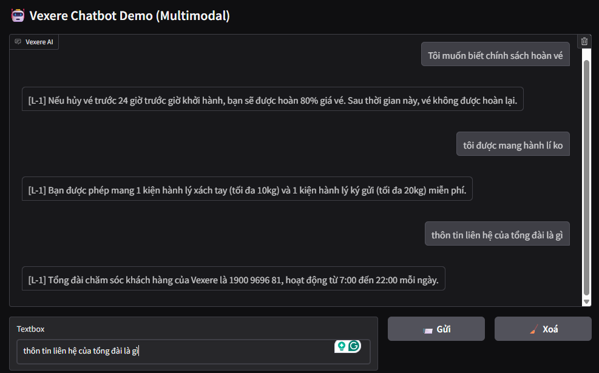
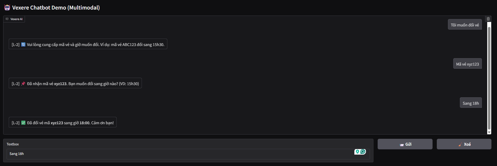
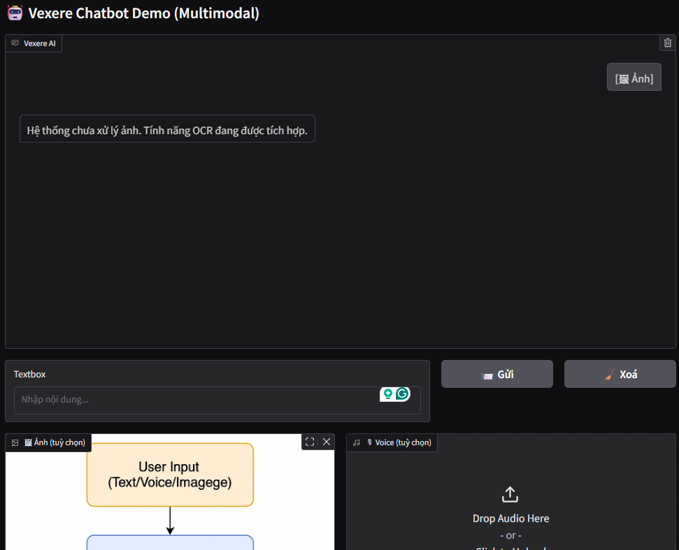
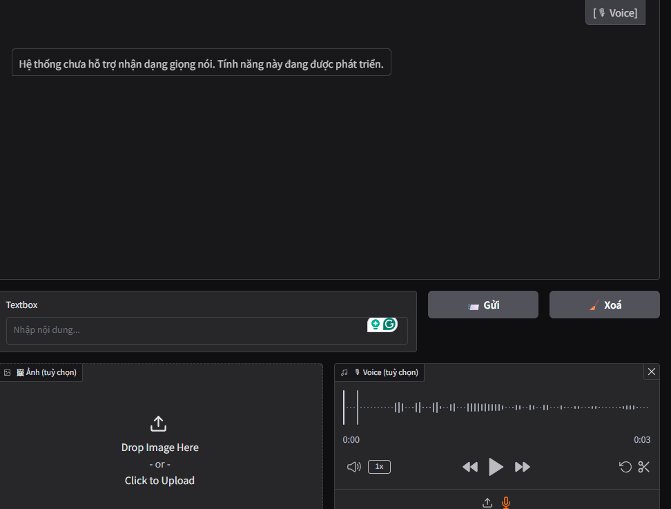

# 🤖 Vexere AI Chatbot - Take-home Project (POC)

Đây là prototype chatbot AI đa năng cho nền tảng Vexere, hỗ trợ:

- ✅ L-1: Trả lời câu hỏi thường gặp (FAQ) bằng RAG (Gemini + FAISS)
- ✅ L-2: Xử lý yêu cầu đổi giờ vé (After-Service, multi-turn)
- ✅ Hỗ trợ đa modal: Text + Audio + Image (đã mock API)

---

## 🏗️ 1. Cài đặt & Chạy

### 📦 Yêu cầu:
- Python >= 3.10
- API key của Google Gemini (Gemini Pro & embedding)

### 📁 Tạo file `.env`
```env
GEMINI_KEY=your_google_api_key_here
````

### 🚀 Cài đặt

```bash
pip install -r requirements.txt
```

---

## ▶️ 2. Chạy demo

### ✅ Chạy backend API (FastAPI)

```bash
uvicorn main:app --reload
```

### ✅ Chạy frontend Gradio UI

```bash
python gradio_app.py
```

Giao diện sẽ mở tại: [http://localhost:7860/](http://localhost:7860/)

---

## 🧪 3. Cách test

### 🔹 FAQ – L-1

```text
"Tôi muốn biết chính sách hoàn vé"
"Tôi có được mang hành lý không?"
```


### 🔹 After-Service – L-2 (đổi giờ)

```text
"Tôi muốn đổi vé"
"Mã vé là ABC123"
"Đổi sang 17h"
```

Bot sẽ phản hồi từng bước và ghi nhớ thông tin.




### 🔹 Chèn ảnh


### 🔹 Chèn âm thanh


---

## 🛠️ 4. Kiến trúc chính

```
├── app/
│   ├── rag_faq.py             # RAG-FAQ via Gemini + FAISS
│   ├── after_service.py       # Logic đổi giờ vé (multi-turn)
│   ├── utils.py               # Classify intent qua Gemini
├── gradio_app.py              # Giao diện demo
├── main.py                    # FastAPI API
├── sample_data/faq.json       # Dữ liệu câu hỏi thường gặp
├── .env                       # Chứa GEMINI_KEY
```

---

## 🔧 5. Ghi chú kỹ thuật

* **Gemini API** được dùng để:

  * Phân loại intent
  * Truy vấn trả lời RAG
* **FAISS** lưu vector cho module RAG
* **Gradio** cung cấp UI test nhanh
* **Voice / Image** có API sẵn (`/upload-voice`, `/upload-image`) – chưa xử lý nội dung thật

---